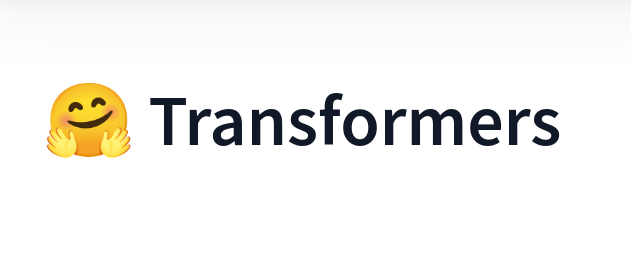

# Hugging Face Transformers Course

## Course Structure
1. [Transformer Models](./Chapter1/)
2. [Using Hugging Face Transformers](./Chapter2/)
3. [Fine Tuning a Pretrained Model](./Chapter3/)
4. [Sharing Models and Tokenizers](./Chapter4/)
5. [The Hugging Face Datasets Library](./Chapter5/)
6. [The Hugging Face Tokenizers Library](./Chapter6/)
7. [Main NLP Tasks](./Chapter7/)

## References
- [Hugging Face Transformers Course](https://huggingface.co/course)

__IN PROGRESS__